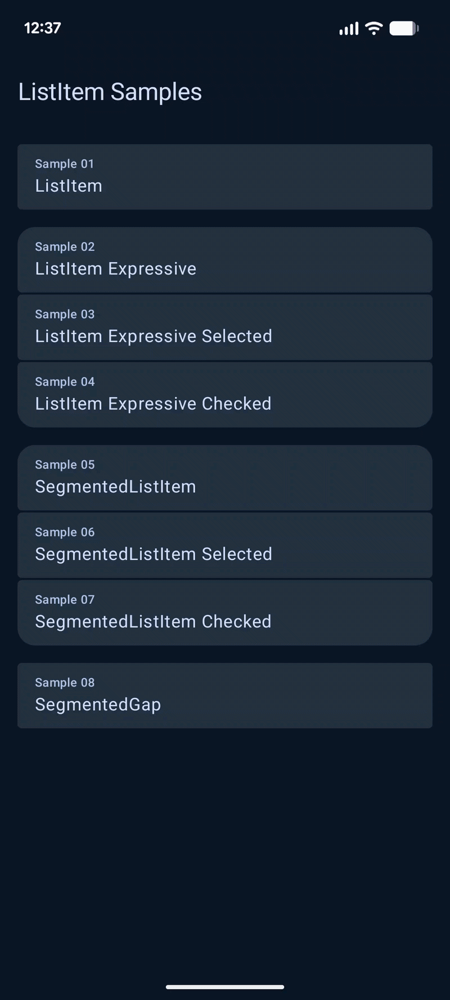
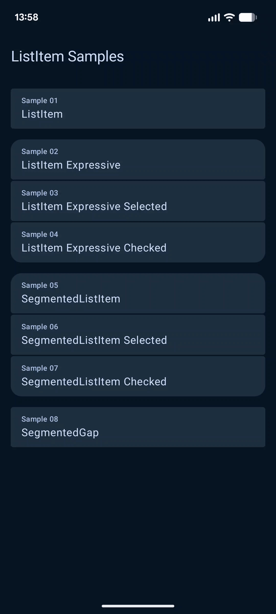
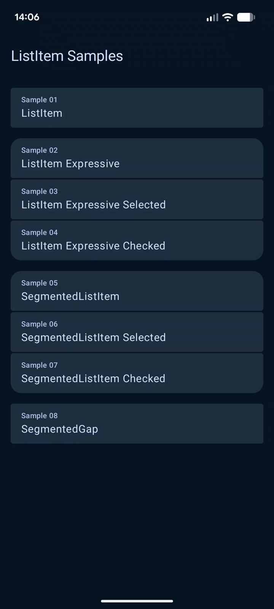
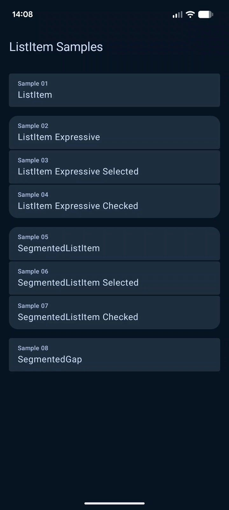

# ListItem

A collection of Android samples demonstrating `ListItem`, `ListItem Expressive`, and `SegmentedListItem` components from Jetpack Compose Material 3.

<table>
  <tr>
    <td></td>
    <td></td>
    <td></td>
    <td></td>
  </tr>
</table>

## Samples

| # | Sample                                                                                                                           | Description                                                                              |
|---|----------------------------------------------------------------------------------------------------------------------------------|------------------------------------------------------------------------------------------|
| 1 | [ListItem](app/src/main/kotlin/org/michaelbel/listitem/sample01_ListItem/Sample01App.kt)                                         | Basic `ListItem` usage with headline, overline, supporting, leading and trailing content |
| 2 | [ListItem Expressive](app/src/main/kotlin/org/michaelbel/listitem/sample02_ListItem_Expressive/Sample02App.kt)                   | Expressive variant of `ListItem` from Material 3 Expressive                              |
| 3 | [ListItem Expressive Selected](app/src/main/kotlin/org/michaelbel/listitem/sample03_ListItem_Expressive_Selected/Sample03App.kt) | Expressive `ListItem` with selected state                                                |
| 4 | [ListItem Expressive Checked](app/src/main/kotlin/org/michaelbel/listitem/sample04_ListItem_Expressive_Checked/Sample04App.kt)   | Expressive `ListItem` with checked state                                                 |
| 5 | [SegmentedListItem](app/src/main/kotlin/org/michaelbel/listitem/sample05_SegmentedListItem/Sample05App.kt)                       | Basic `SegmentedListItem` usage                                                          |
| 6 | [SegmentedListItem Selected](app/src/main/kotlin/org/michaelbel/listitem/sample06_SegmentedListItem_Selected/Sample06App.kt)     | `SegmentedListItem` with selected state                                                  |
| 7 | [SegmentedListItem Checked](app/src/main/kotlin/org/michaelbel/listitem/sample07_SegmentedListItem_Checked/Sample07App.kt)       | `SegmentedListItem` with checked state                                                   |
| 8 | [SegmentedGap](app/src/main/kotlin/org/michaelbel/listitem/sample08_SegmentedGap/Sample08App.kt)                                 | `SegmentedGap` – spacing between segmented list items                                    |
